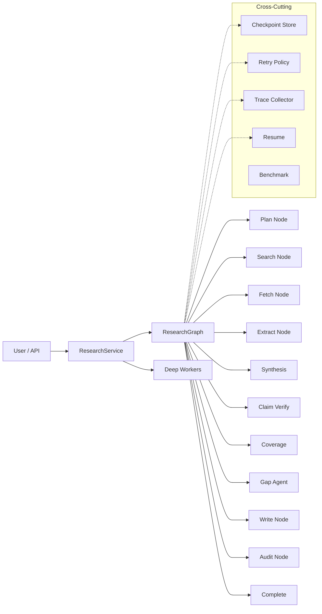

# ResearchForge — Multi-Mode LLM Research Agent

[]()
[]()
[]()

**ResearchForge** is an LLM-powered research agent that autonomously plans, searches, extracts evidence, synthesizes findings, writes reports, and evaluates quality — across three operating modes with checkpoint/resume, retry, observability, and benchmarking built in.

> 中文简介：ResearchForge 是一个多模式 LLM 研究 Agent 系统，支持 Fast / Standard / Deep 三种运行模式，自动完成从规划、搜索、证据提取到报告写作和审计的完整研究流程。内置检查点、重试、可观测性和基准测试框架。

---

## Features

### Agent Runtime
- **Three modes**: Fast (lightweight), Standard (full pipeline), Deep (multi-worker parallel)
- **State machine**: ResearchGraph drives 13-state flow with mode-specific paths
- **ResearchState**: Single data object carries all artifacts through the pipeline

### Reliability
- **Checkpoint / Resume**: Atomic state persistence per task; recover failed or interrupted runs
- **RetryPolicy**: White-list based retry with exponential backoff, per-node configuration
- **Graceful Degradation**: Claim verification and audit fall back to degraded mode when LLM fails — research continues without hard failure

### Deep Research
- **Parallel Workers**: LeadResearcher splits topic → multiple ResearchWorker instances run search/fetch/extract concurrently
- **Worker-Level Resume**: Only failed/running workers re-execute on resume; completed workers restored from checkpoint
- **Conflict Analysis**: Cross-worker evidence conflicts detected after merge

### Observability
- **TraceCollector**: Every node_start/node_end, retry, degradation, and resume event recorded with timing
- **Persistent Trace**: JSONL-backed TraceStore, thread-safe concurrent writes
- **Trace API**: `GET /api/research/{id}/traces` with stage/agent filtering, timestamp ordering
- **Timeline UI**: Modal popup shows all trace events by agent group with visual stage badges

### Evaluation
- **Claim Metrics**: Distribution of supported / partially / unsupported / unverified claims
- **Citation Metrics**: Report citation marks validated against source IDs
- **Coverage Metrics**: Per-question evidence coverage (Standard/Deep modes)
- **Execution Metrics**: Per-node duration, retry/degraded/resume counts, slowest node
- **Quality Score**: Weighted composite score with A–F grade
- **Benchmark Framework**: Reusable case definitions + runner + comparison report across modes

---

## Three Operating Modes

| Mode     | Characteristics                          | Best For                          |
| -------- | ---------------------------------------- | --------------------------------- |
| Fast     | Low latency, lightweight, no audit       | Quick topic overview              |
| Standard | Full pipeline with coverage + audit      | Structured reports                |
| Deep     | Multi-worker parallel, conflict analysis | Complex, multi-angle topics       |

Fast skips evaluating → gap_searching → auditing → human_review. Standard runs the full pipeline with one gap-search round. Deep adds parallel workers, conflict detection, and up to two gap-search rounds.

---

## System Architecture



### Execution Flows

**Fast / Standard** — single-thread state machine:
```
Plan → Search → Fetch → Extract → (Evaluate → Gap?) → Synthesize → Write → (Audit → Rewrite?) → Complete
```

**Deep** — multi-worker parallel:
```
LeadResearcher.make_plan()
    │
    ├─ Worker[W1] ── Search/Fetch/Extract ──┐
    ├─ Worker[W2] ── Search/Fetch/Extract ──┤── Merge ── Conflicts ── post-harvest pipeline ── Complete
    ├─ Worker[W3] ── Search/Fetch/Extract ──┘
    └─ ... (up to 5)
```

**Failure → Retry → Checkpoint → Resume**:
```
Node fails → RetryPolicy.should_retry? → yes → backoff → retry
                                       → no  → mark_node_failed → save checkpoint → raise
Resume → load checkpoint → _should_run() skips completed nodes → continue from first incomplete node
```

**Deep Worker Partial Failure → Resume**:
```
Worker fails → checkpoint saved (status=failed)
Resume → completed workers restored → only failed workers re-execute
```

---

## Quick Start

### Prerequisites

- Python 3.11+
- (Optional) Ollama for local LLM inference

### Installation

```bash
# Clone
git clone https://github.com/yourusername/researchforge.git
cd researchforge

# Virtual environment
# Windows:
python -m venv .venv
.venv\Scripts\activate

# Linux / macOS:
python -m venv .venv
source .venv/bin/activate

# Install
pip install -r requirements.txt
```

### Configuration

```bash
cp .env.example .env
```

Edit `.env` to set your LLM provider:

| Variable             | Required      | Description                                      |
| -------------------- | ------------- | ------------------------------------------------ |
| `DASHSCOPE_API_KEY`  | Yes (Bailian) | Alibaba Cloud Bailian (DashScope) API key        |
| `LLM_PROVIDER`       | Yes           | `bailian` or `ollama`                            |
| `RESEARCHFORGE_MODEL`| Yes           | Model name (e.g. `kimi-k2.6`, `qwen3.5:9b`)     |
| `OLLAMA_BASE_URL`    | Ollama only   | Ollama server URL (default: `http://localhost:11434`) |
| `LLM_TIMEOUT`        | No            | LLM request timeout (default: 600s)              |
| `PORT`               | No            | Server port (default: 8002)                      |

### Start Server

#### Option A: Docker (Recommended)

```bash
# Build and start
docker compose up --build

# Or run in background
docker compose up -d

# View logs
docker compose logs -f
```

#### Option B: Python directly

```bash
python -m uvicorn researchforge.service.app:app --host 0.0.0.0 --port 8002
```

Open **http://localhost:8002/** in your browser.

> No LLM? Run the mock demo or click **SSE Test** in the UI.

### Quick Demo (Docker)

```bash
# Run all three modes with mock data
docker compose run --rm researchforge python demo/scripts/run_demo.py --all --mock

# Run a single case
docker compose run --rm researchforge python demo/scripts/run_demo.py --case fast_simple --mock

# Run with fault injection (triggers retry)
docker compose run --rm researchforge python demo/scripts/run_demo.py --case fast_simple --mock --inject-fault
```

Demo outputs are saved to `demo/outputs/` on the host.

---

## Testing

```bash
# Run all tests
pytest researchforge/tests/ benchmarks/tests/ -v

# 264 tests passed
```

| Area                | Tests |
| ------------------- | ----- |
| ResearchGraph       | 63    |
| Checkpoint / Resume | 23    |
| Retry / Degradation | 32    |
| Deep Workers        | 13    |
| Trace               | 27    |
| Evaluation          | 51    |
| Benchmark           | 18    |
| Frontend            | 21    |
| Service             | 6     |
| Checkpoint Store    | 16    |
| Research State      | 10    |

---

## Evaluation Stats

Every completed research run produces a unified `stats` structure:

```python
"stats": {
  "claims": { "total": 3, "supported": 2, "supported_rate": 0.6667, ... },
  "citation": { "total_marks": 8, "valid_rate": 0.875, "source_utilization_rate": 0.6 },
  "coverage": { "evaluated": true, "coverage_rate": 0.75, "gap_count": 1 },
  "audit": { "passed": true, "rewritten": 0, "degraded": false, "issues_count": 0 },
  "execution": { "duration_s": 45.2, "retry_count": 2, "slowest_node": "WRITING" },
  "quality": { "quality_score": 87.5, "grade": "B", "breakdown": { ... } }
}
```

> Quality Score is an internal heuristic-based scoring system designed for mode-to-mode and task-to-task comparison. It does not represent absolute factual accuracy.

---

## Benchmark

Benchmark cases are stored as JSON in `benchmarks/cases/`. Each case defines a topic and the modes to run.

```python
from unittest.mock import Mock
from benchmarks.benchmark_runner import load_cases, run_benchmark
from benchmarks.benchmark_report import build_report, format_report_text

# Load case and create mock LLM
cases = load_cases(case_ids=["simple_research"])
llm = Mock()
llm.generate.return_value = "mock response"

# Run
result = run_benchmark(cases[0], llm)
report = build_report(result)
print(format_report_text(report))
```

Output:
```
=== Benchmark: simple_research ===
  [FAST] ✅    20.5s | 来源: 3 | 质量: 87.5 (B)
  [STANDARD] ✅ 45.2s | 来源: 5 | 质量: 92.0 (A)
  [DEEP] ✅    90.8s | 来源: 12 | 质量: 95.0 (A)
```

> Benchmark tests use mocked LLMs — no external API calls during testing.

---

## API Overview

| Method | Path                               | Description                      |
| ------ | ---------------------------------- | -------------------------------- |
| POST   | `/api/research`                    | Start a research task            |
| GET    | `/api/status/{id}`                 | Get task status                  |
| GET    | `/api/stream/{id}`                 | SSE event stream                 |
| GET    | `/api/history`                     | List history tasks               |
| POST   | `/api/research/{id}/resume`        | Resume a failed task             |
| GET    | `/api/research/{id}/traces`        | Query trace events               |
| GET    | `/api/research/{id}/events`        | Query history events             |
| DELETE | `/api/research/{id}`               | Delete a task                    |
| POST   | `/api/review/{id}`                 | Human review                     |
| GET    | `/api/checkpoints`                 | List recoverable checkpoints     |
| GET    | `/api/benchmark/cases`             | List benchmark cases             |
| POST   | `/api/benchmark/run`               | Run a benchmark                  |
| GET    | `/api/benchmark/result/{id}`       | Get benchmark result             |

---

## Project Structure

```
researchforge/
├── core/              — LLM providers (Bailian, Ollama), Planner
├── evaluation/        — Evaluation metrics, execution stats, quality score
├── nodes/             — 10 pipeline nodes (plan → search → fetch → ... → audit)
├── orchestration/     — ResearchGraph, ResearchState, ModePolicy, RetryPolicy, CheckpointStore
├── rag/               — Evidence retrieval (BM25 + vector)
├── research_service.py — Unified service entry point
├── service/           — FastAPI app, SSE, static frontend
├── tools/             — Web search (DuckDuckGo)
├── trace/             — TraceCollector, TraceStore (JSONL persistence)
└── tests/             — 17 test files (264 tests)

benchmarks/
├── benchmark_runner.py  — Run benchmark cases
├── benchmark_report.py  — Generate comparison reports
├── cases/               — JSON case definitions
└── tests/               — Benchmark tests
```

---

## Limitations

- **Quality Score is heuristic**: It helps compare runs but does not guarantee factual accuracy.
- **Search quality depends on external sources**: Results vary by search engine availability.
- **Claim Verification depends on LLM**: Evidence-to-claim verification quality is bounded by the configured model.
- **Frontend is single-file**: `index.html` with embedded CSS/JS. Functional but not production-grade.
- **Storage is file-based**: Local JSON/JSONL files. Suitable for demos, not large-scale production.
- **No authentication or multi-tenant**: API has no auth layer — suited for local or trusted-network use.

---

## Roadmap

- **Database-backed persistence** — SQLite or PostgreSQL for reliability and scale
- **Token / cost tracking** — Count LLM tokens and API costs per task
- **Authentication** — API key auth and user isolation
- **Distributed Workers** — Run Deep Workers across processes or machines
- **CLI interface** — `researchforge run "topic" --mode deep`

---

## License

MIT
