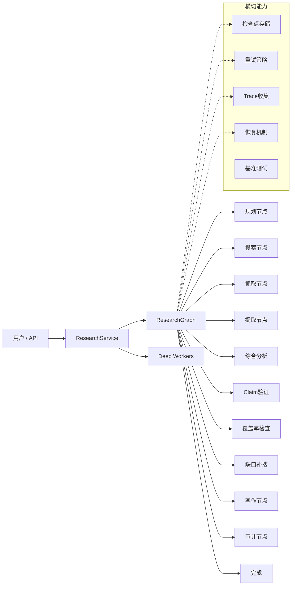

# ResearchForge — 多模式 LLM 研究 Agent

[]()
[]()
[]()

**ResearchForge** 是一个基于 LLM Agent 的自动化研究系统。输入一个主题，系统自动完成规划、搜索、抓取、证据提取、综合分析、报告写作和审计的全流程。支持 Fast / Standard / Deep 三种运行模式，内置检查点恢复、重试策略、可观测性和基准测试框架。

---

## 核心能力

### Agent 运行时
- **三模式**: Fast（轻量快速）、Standard（完整管线）、Deep（多 Worker 并行）
- **状态机**: ResearchGraph 驱动 13 个状态的模式化执行流
- **ResearchState**: 单一数据对象承载整个管线的所有中间产物

### 可靠性
- **检查点 / 恢复**: 逐节点 atomic 状态持久化，失败任务可从断点恢复
- **重试策略**: 白名单异常分类 + 指数退避 + 节点级配置
- **优雅降级**: Claim 验证和审计在 LLM 失败时自动降级，研究不中断

### Deep 深度研究
- **并行 Worker**: LeadResearcher 拆解主题 → 多个 ResearchWorker 并发搜索/抓取/提取
- **Worker 级恢复**: 仅重新执行失败/中断的 Worker，已完成 Worker 从检查点恢复
- **冲突分析**: Worker 合并后检测跨来源证据冲突

### 可观测性
- **TraceCollector**: 记录每个 node_start/node_end、重试、降级、恢复事件及时长
- **持久化 Trace**: JSONL 存储，线程安全并发写入
- **Trace API**: `GET /api/research/{id}/traces` 支持 stage/agent 筛选和时间戳排序
- **时间线 UI**: 弹窗按 agent 分组展示全部事件，重试/失败/降级/恢复彩色标识

### 评估体系
- **Claim 分布**: 可信 / 部分可信 / 不可信 / 未验证 结论分布
- **引用指标**: 报告引用标记与来源 ID 校验（有效率、来源利用率）
- **覆盖率**: 逐问题证据覆盖评估（Standard/Deep 模式）
- **执行指标**: 节点耗时、重试/降级/恢复次数、最慢节点
- **质量评分**: 加权综合评分 + A~F 等级（Claim 30% / 引用 25% / 覆盖 25% / 审计 20%）
- **Benchmark 框架**: JSON case 定义 + 运行器 + 跨模式对比报告

---

## 三种运行模式

| 模式 | 特点 | 适用场景 |
|------|------|---------|
| **Fast** | 低延迟、轻量、无审计 | 快速了解主题 |
| **Standard** | 完整研究管线 | 常规结构化报告 |
| **Deep** | 多 Worker 并行、冲突分析 | 复杂多角度主题 |

Fast 跳过 evaluating → gap_searching → auditing → human_review。Standard 运行完整管线+一轮补搜。Deep 增加并行 Worker、冲突检测和最多两轮补搜。

---

## 系统架构



---

## 快速开始

### 前置要求

- Python 3.11+
- Docker（可选，推荐）

### Docker 一键启动

```bash
docker compose up --build -d
```

打开 **http://localhost:8002/** 即可使用。

### 本地安装

```bash
git clone https://github.com/feather011/ResearchForge.git
cd ResearchForge

# Windows:
python -m venv .venv
.venv\Scripts\activate

# Linux / macOS:
python -m venv .venv
source .venv/bin/activate

pip install -r requirements.txt
cp .env.example .env
```

编辑 `.env` 填入你的 API Key，然后：

```bash
python -m uvicorn researchforge.service.app:app --host 0.0.0.0 --port 8002
```

### 无需 API Key 的 Mock Demo

```bash
# 全部三种模式
python demo/scripts/run_demo.py --all --mock

# 单个案例
python demo/scripts/run_demo.py --case fast_simple --mock

# 故障注入演示（触发重试）
python demo/scripts/run_demo.py --case fast_simple --mock --inject-fault
```

Docker 环境：

```bash
docker compose run --rm researchforge python demo/scripts/run_demo.py --all --mock
```

---

## 环境变量

| 变量 | 必填 | 说明 |
|------|------|------|
| `DASHSCOPE_API_KEY` | 是 (Bailian) | 阿里云百炼平台 API Key |
| `LLM_PROVIDER` | 是 | `bailian` 或 `ollama` |
| `RESEARCHFORGE_MODEL` | 是 | 模型名（如 `kimi-k2.6`、`qwen3.5:9b`）|
| `OLLAMA_BASE_URL` | Ollama 时必填 | Ollama 服务地址 |
| `LLM_TIMEOUT` | 否 | LLM 请求超时（默认 600s）|
| `PORT` | 否 | 服务端口（默认 8002）|

---

## 测试

```bash
# 运行全部测试
pytest researchforge/tests/ benchmarks/tests/ demo/tests/ -v

# 280 tests passed
```

| 测试范围 | 数量 |
|---------|------|
| ResearchGraph 状态机 | 63 |
| 检查点 / 恢复 | 23 |
| 重试 / 降级 | 32 |
| Deep Workers | 13 |
| Trace | 27 |
| 评估指标 | 51 |
| Benchmark | 18 |
| Demo | 16 |
| 前端结构 | 21 |
| 其他 | 26 |

---

## 评估统计

每个完成的研究任务产出统一 `stats` 结构：

```python
"stats": {
  "claims": { "total": 3, "supported": 2, "supported_rate": 0.6667 },
  "citation": { "total_marks": 8, "valid_rate": 0.875, "source_utilization_rate": 0.6 },
  "coverage": { "evaluated": true, "coverage_rate": 0.75, "gap_count": 1 },
  "audit": { "passed": true, "rewritten": 0, "degraded": false },
  "execution": { "duration_s": 45.2, "retry_count": 2, "slowest_node": "WRITING" },
  "quality": { "quality_score": 87.5, "grade": "B" }
}
```

> 质量分是项目内部启发式规则评分，用于任务和模式间对比，不代表绝对事实准确率。

---

## API 概览

| 方法 | 路径 | 说明 |
|------|------|------|
| POST | `/api/research` | 启动研究任务 |
| GET | `/api/status/{id}` | 查询任务状态 |
| GET | `/api/stream/{id}` | SSE 事件流 |
| GET | `/api/history` | 历史任务列表 |
| POST | `/api/research/{id}/resume` | 恢复失败任务 |
| GET | `/api/research/{id}/traces` | 查询 Trace 事件 |
| GET | `/api/checkpoints` | 可恢复检查点列表 |
| GET | `/api/benchmark/cases` | Benchmark case 列表 |
| POST | `/api/benchmark/run` | 运行 Benchmark |
| GET | `/health` | 容器健康检查 |

---

## 项目结构

```
researchforge/
├── core/              — LLM Provider、Planner
├── evaluation/        — 评估指标、质量评分
├── nodes/             — 10 个管线节点
├── orchestration/     — 状态机、模式策略、检查点、重试
├── rag/               — 证据检索
├── research_service.py — 统一服务入口
├── service/           — FastAPI、SSE、前端
├── tools/             — 搜索工具
├── trace/             — Trace 收集器 + 存储
└── tests/             — 17 个测试文件

benchmarks/            — Benchmark 框架
demo/                  — Mock/真实 Demo
```

---

## 局限性与说明

- **质量分为启发式规则**，不代表绝对事实准确率
- **搜索质量依赖外部来源**（DuckDuckGo 或配置的搜索引擎）
- **Claim 验证依赖 LLM**，质量受限于模型能力
- **前端为单文件实现**（~2000 行），功能完整但非生产级
- **存储为文件系统 JSON/JSONL**，适合 Demo 和开发
- **无认证和多租户**，适合本地或可信网络使用

---

## License

MIT
